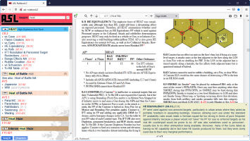

# ASL Rulebook 2

This program lets you search through the ASL Rulebook index, and jump directly to the rules you're looking for.

Click [here](https://htmlpreview.github.io/?https://github.com/pacman-ghost/asl-rulebook2/blob/master/doc/features/index.html) for more details.
 

With [some work](doc/extend.md), you can also:
- add rules for other modules
- have Q+A and errata automatically pop-up when you click on a rule
- include your own annotations
- include the ASOP, complete with clickable links to each rule

*NOTE: The program requires Firefox; Chrome doesn't support a key feature it needs.*

*NOTE: This project integrates with my other [`asl-articles`](https://github.com/pacman-ghost/asl-articles) project, so that if an article references a rule, it becomes a clickable link that will open a browser showing that rule. The [`vasl-templates`](https://github.com/pacman-ghost/vasl-templates) project can also be configured to allow vehicles and ordnance to open their corresponding Chapter H entries.*

### Installation

After cloning the repo, you can either:
- run it using Docker (recommended, run `./run-container.sh --port 5020`)
- run it from source (requires Python 3.8.7, install the module, run `asl_rulebook2/webapp/run_server.py`)

*NOTE: Run either command with `--help` to get help.*

Then connect to the server in a browser at `http://localhost:5020`.

A few things need to be set up before the program can be used; the webapp will guide you through the process.

*NOTE: If you are running from source, you will also need Ghostscript installed.*

### Preparing the data files

The first time the program is run, the MMP eASLRB PDF must be analyzed, and some key data extracted and prepared. The webapp will do this for you automatically, but in the event there are problems, [this page](doc/prepare.md) describes how to do it manually.

### FAQ

- Why is this project called ASL Rulebook *2*?   *Several years ago, I wrote a similar *ASL Rulebook* project that worked from a scanned copy of the ASLRB. Since it required a prepared version of the PDF, which couldn't be distributed, there was no point releasing the source code. When MMP released their official eASLRB, I updated the code to work with that, and have released it here.*
- Why doesn't the sidebar update (e.g. to show Q+A) when I click on links within the PDF itself?   *This is due to the way the program is architected. The PDF is shown in an iframe, and so the outer application can't get event notifications for things that happen inside that iframe. I might revisit this later (but it's a *lot* of work :-/).*
